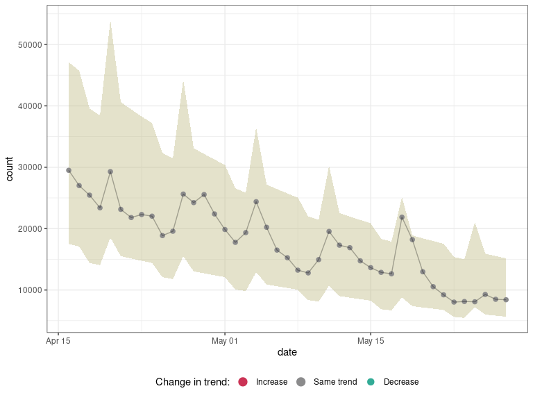
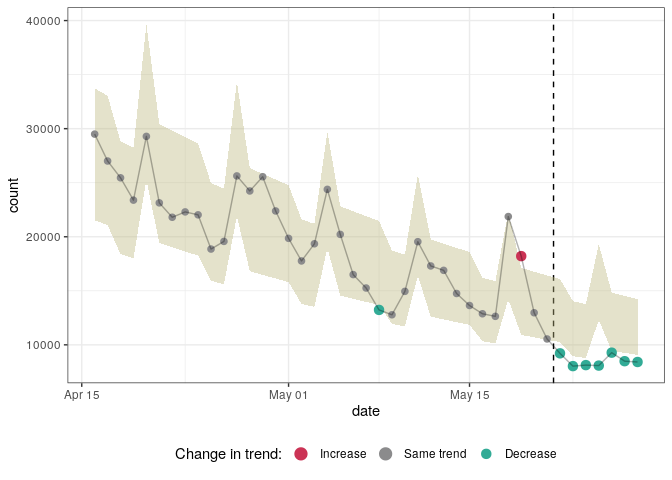

<!-- README.md is generated from README.Rmd. Please edit that file -->

# epichange

<!-- badges: start -->

[](https://github.com/reconhub/epichange/actions)
<!-- badges: end -->

The *epichange* package implements tools for detecting changes in
temporal trends of a single response variable. It provides a coherent
interface to several modeling tools, alonside functions for model
selection and outlier detection. It implements the **A**utomatic
**S**election of **M**odels and **O**utlier **De**tection for
**E**pidemmics (ASMODEE), an algorithm originally designed for detecting
changes in COVID-19 case incidence.

ASMODEE proceeds by:

1.  defining a training set excluding the last *k* data points
2.  identifying the temporal trend in the training set by fitting a
    range of (user-specified) models to the data and retaining the best
    predicting / fitting model
3.  calculating the prediction interval (PI) of the temporal trend
4.  classifying any data point outside the PI as outlier

The algorithm can be applied with fixed, user-specified value of *k*, so
as to monitor potential changes in this recent time period.
Alternatively, the optimal value of *k* can be determined automatically.

**Disclaimer:** this is work in progress. Please reach out to the
authors before using this package. Also note this package may soon be
renamed to avoid clashes with other projects and reflect a more general
scope.

## Getting started

Once it is released on [CRAN](https://CRAN.R-project.org), you will be
able to install the stable version of the package with:

``` r
install.packages("epichange")
```

The development version can be installed from
[GitHub](https://github.com/) with:

``` r
if (!require(remotes)) {
  install.packages("remotes")
}
remotes::install_github("reconhub/epichange")
```

The best place to start for using this package is to read the
documentation of the function `asmodee` and run its example:

``` r
library(epichange)
?asmodee
example(asmodee)
```

## Main features

The package implements the following main functions

  - `asmodee`: implements the Automatic Selection of Models and Outlier
    DEtection for Epidemics

  - `select_model`: a function to select the
    best-fitting/best-predicting model from a range of user-specified
    models

  - `detect_changepoint`: a function to detect the points at which
    recent data deviate from previous temporal trends using a fitted
    model and data

  - `detect_outliers`: a function to identify outliers using a fitted
    model and data

### ASMODEE

We illustrate ASMODEE using publicly available NHS pathways data
recording self-reporting of potential COVID-19 cases in England (see
`?nhs_pathways_covid19` for more information). ASMODEE would typically
be more useful to investigate shifts in temporal trends from a large
number of time series (e.g. at a fine geographic scale), but is this is
purely for illustrative purposes, we use the full dataset for England.
See `?asmodee` for further example stratified by geographic units.

``` r

library(epichange)
library(tidyverse)

# load data
data(nhs_pathways_covid19)

# select last 6 weeks of data
first_date <- max(nhs_pathways_covid19$date, na.rm = TRUE) - 6*7
pathways_recent <- nhs_pathways_covid19 %>%
  filter(date >= first_date)

# define candidate models
models <- list(
  regression = lm_model(count ~ day),
  poisson_constant = glm_model(count ~ 1, family = "poisson"),
  negbin_time = glm_nb_model(count ~ day),
  negbin_time_weekday = glm_nb_model(count ~ day + weekday)
)

# analyses on all data
counts_overall <- pathways_recent %>%
  group_by(date, day, weekday) %>%
  summarise(count = sum(count))
#> `summarise()` regrouping output by 'date', 'day' (override with `.groups` argument)

# results with automated detection of 'k'
res <- asmodee(counts_overall, models, method = evaluate_aic)
res
#> $k
#> [1] 7
#> 
#> $model
#> $model
#> 
#> Call:  MASS::glm.nb(formula = count ~ day + weekday, data = data, init.theta = 76.80468966, 
#>     link = log)
#> 
#> Coefficients:
#>    (Intercept)             day   weekdaymonday  weekdayweekend  
#>       10.81062        -0.02057         0.24398        -0.11588  
#> 
#> Degrees of Freedom: 35 Total (i.e. Null);  32 Residual
#> Null Deviance:       186.5 
#> Residual Deviance: 36.09     AIC: 665.4
#> 
#> $predict
#> function (newdata, alpha = 0.05) 
#> {
#>     suppressWarnings(res <- add_prediction_interval(data = newdata, 
#>         model = model, alpha = alpha))
#>     col_name <- as.character(formula[[2]])
#>     append_observed_column(res, res[[col_name]])
#> }
#> <bytecode: 0x56176afd6500>
#> <environment: 0x561779971f10>
#> 
#> attr(,"class")
#> [1] "epichange_model_fit" "list"               
#> 
#> $n_outliers
#> [1] 9
#> 
#> $n_outliers_train
#> [1] 2
#> 
#> $n_outliers_recent
#> [1] 7
#> 
#> $p_value
#> [1] 4.076898e-05
#> 
#> $results
#> # A tibble: 43 x 10
#> # Groups:   date, day [43]
#>    date         day weekday count   pred lower upper observed outlier
#>    <date>     <int> <fct>   <int>  <dbl> <dbl> <dbl>    <int> <lgl>  
#>  1 2020-04-16    29 rest_o… 29497 27288. 21520 33729    29497 FALSE  
#>  2 2020-04-17    30 rest_o… 27007 26733. 21082 33043    27007 FALSE  
#>  3 2020-04-18    31 weekend 25453 23323. 18392 28829    25453 FALSE  
#>  4 2020-04-19    32 weekend 23387 22848. 18018 28243    23387 FALSE  
#>  5 2020-04-20    33 monday  29287 32078. 25299 39648    29287 FALSE  
#>  6 2020-04-21    34 rest_o… 23134 24621. 19417 30434    23134 FALSE  
#>  7 2020-04-22    35 rest_o… 21803 24120. 19021 29815    21803 FALSE  
#>  8 2020-04-23    36 rest_o… 22298 23629. 18634 29208    22298 FALSE  
#>  9 2020-04-24    37 rest_o… 22027 23148. 18254 28613    22027 FALSE  
#> 10 2020-04-25    38 weekend 18861 20196. 15925 24965    18861 FALSE  
#> # … with 33 more rows, and 1 more variable: classification <fct>
#> 
#> attr(,"class")
#> [1] "epichange" "list"
plot(res, "date")
```



``` r

# results with fixed value of 'k' (7 days)
res_k7 <- asmodee(counts_overall, models, fixed_k = 7)
plot(res_k7, "date")
```



### Model selection

You can define a number of different regression models using a common
interface. Once defined you can use different strategies to select the
best-fitting/best-predicting model.

As an example we try to predict `hp` of the famous `mtcars` dataset. Of
course, this is just a toy example. Usually you would use the package to
predict counts data in a time series.

First we define some potential models:

``` r
library(epichange)
stan_cache <- tempfile() # stan compile to c++ and we cache the code
models <- list(
  null = lm_model(hp ~ 1),
  glm_poisson = glm_model(hp ~ 1 + cyl + drat + wt + qsec + am, poisson),
  lm_complex = lm_model(hp ~ 1 + cyl + drat + wt + qsec + am),
  negbin_complex = glm_nb_model(hp ~ 1 + cyl + drat + wt + qsec + am),
  brms_complex = brms_model(
    hp ~ 1 + cyl + drat + wt + qsec + am,
    family = brms::negbinomial(),
    file = stan_cache
  )
)
```

Then we evaluate them using [N-Fold cross
validation](https://en.wikipedia.org/wiki/Cross-validation_\(statistics\)).

``` r
# we do CV and evaluate three loss function:
# Root-mean-squared error, the huber-loss and mean absolute error.
# The package works with `yardstick` by default.
out <- capture.output( # no log output in readme :)
  auto_select <- select_model(mtcars, models,
    method = evaluate_resampling,
    metrics = list(yardstick::rmse, yardstick::huber_loss, yardstick::mae)
  )
)
auto_select$leaderboard
#> # A tibble: 5 x 4
#>   model          huber_loss   mae  rmse
#>   <chr>               <dbl> <dbl> <dbl>
#> 1 brms_complex         18.4  18.9  18.9
#> 2 glm_poisson          21.2  21.7  21.7
#> 3 negbin_complex       22.8  23.3  23.3
#> 4 lm_complex           26.2  26.7  26.7
#> 5 null                 57.8  58.3  58.3
```
