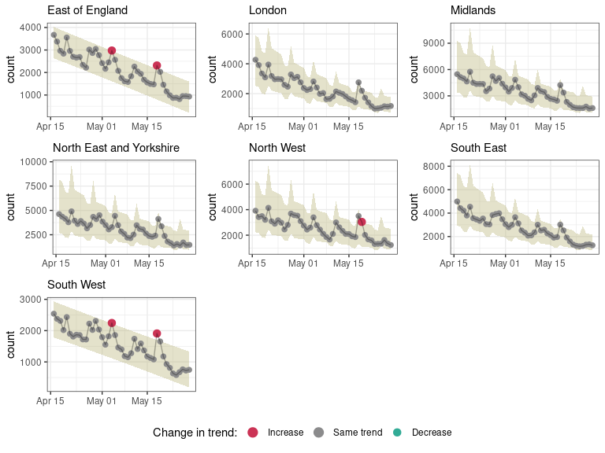

<!-- README.md is generated from README.Rmd. Please edit that file -->

# trendbreaker

<!-- badges: start -->

[](https://doi.org/10.5281/zenodo.3888494)
[](https://github.com/reconhub/trendbreaker/actions)
[](https://codecov.io/gh/reconhub/trendbreaker?branch=master)
[](https://github.com/reconhub/trendbreaker/actions)
<!-- badges: end -->

The *trendbreaker* package implements tools for detecting changes in
temporal trends of a single response variable. It implements the
**A**utomatic **S**election of **M**odels and **O**utlier **De**tection
for **E**pidemmics (ASMODEE), an algorithm originally designed for
detecting changes in COVID-19 case incidence.

ASMODEE proceeds by:

1.  defining a training set excluding the last *k* data points
2.  identifying the temporal trend in the training set by fitting a
    range of (user-specified) models to the data and retaining the best
    predicting / fitting model
3.  calculating the prediction interval (PI) of the temporal trend
4.  classifying any data point outside the PI as outlier

The algorithm can be applied with fixed, user-specified value of *k*, so
as to monitor potential changes in this recent time period.
Alternatively, the optimal value of *k* can be determined automatically.

**Disclaimer:** this is work in progress. Please reach out to the
authors before using this package. Also note this package may soon be
renamed to avoid clashes with other projects and reflect a more general
scope.

## Getting started

Once it is released on [CRAN](https://CRAN.R-project.org), you will be
able to install the stable version of the package with:

``` r
install.packages("trendbreaker")
```

The development version can be installed from
[GitHub](https://github.com/) with:

``` r
if (!require(remotes)) {
  install.packages("remotes")
}
remotes::install_github("reconhub/trendbreaker")
```

The best place to start for using this package is to read the
documentation of the function `asmodee` and run its example:

``` r
library(trendbreaker)
?asmodee
example(asmodee)
```

## Main features

### ASMODEE

We illustrate ASMODEE using publicly available NHS pathways data
recording self-reporting of potential COVID-19 cases in England (see
`?nhs_pathways_covid19` for more information).

``` r
library(trendbreaker) # for ASMODEE
library(dplyr)        # for data manipulation
#> 
#> Attaching package: 'dplyr'
#> The following objects are masked from 'package:stats':
#> 
#>     filter, lag
#> The following objects are masked from 'package:base':
#> 
#>     intersect, setdiff, setequal, union
library(future)
plan("multisession")

# load data
data(nhs_pathways_covid19)

# select last 6 weeks of data
first_date <- max(nhs_pathways_covid19$date, na.rm = TRUE) - 6*7
pathways_recent <- nhs_pathways_covid19 %>%
  filter(date >= first_date)

# define candidate models
models <- list(
  regression = lm_model(count ~ day),
  poisson_constant = glm_model(count ~ 1, family = "poisson"),
  negbin_time = glm_nb_model(count ~ day),
  negbin_time_weekday = glm_nb_model(count ~ day + weekday)
)

# analyses on all data
counts_overall <- pathways_recent %>%
  group_by(date, day, weekday) %>%
  summarise(count = sum(count))
#> `summarise()` has grouped output by 'date', 'day'. You can override using the `.groups` argument.

# results with fixed 'k' = 7
res <- asmodee(
  counts_overall,
  models,
  k = 7,
  date_index = "date",
  method = evaluate_aic,
  simulate_pi = TRUE
)
res
#> $k
#> [1] 7
#> 
#> $model_name
#> [1] "negbin_time_weekday"
#> 
#> $trending_model_fit
#> $fitted_model
#> 
#> Call:  MASS::glm.nb(formula = count ~ day + weekday, data = data, init.theta = 76.80468966, 
#>     link = log)
#> 
#> Coefficients:
#>    (Intercept)             day   weekdaymonday  weekdayweekend  
#>       10.81062        -0.02057         0.24398        -0.11588  
#> 
#> Degrees of Freedom: 35 Total (i.e. Null);  32 Residual
#> Null Deviance:       186.5 
#> Residual Deviance: 36.09     AIC: 665.4
#> 
#> $predict
#> function (newdata, alpha = 0.05, add_pi = TRUE, simulate_pi = TRUE, 
#>     uncertain = TRUE) 
#> {
#>     if (missing(newdata)) {
#>         newdata <- data[all.vars(formula(model))]
#>     }
#>     result <- add_confidence_interval(model, newdata, alpha)
#>     if (add_pi) {
#>         if (simulate_pi) {
#>             result <- add_prediction_interval(model, result, 
#>                 alpha, simulate_pi, uncertain)
#>         }
#>         else {
#>             result <- add_prediction_interval(model, result, 
#>                 alpha, simulate_pi, uncertain)
#>         }
#>     }
#>     result
#> }
#> <bytecode: 0x55b9ff02fac0>
#> <environment: 0x55b9fe1ae7c0>
#> 
#> attr(,"class")
#> [1] "trending_model_fit" "list"              
#> 
#> $alpha
#> [1] 0.05
#> 
#> $results
#> # A tibble: 43 x 12
#>    date         day weekday  count .training estimate lower_ci upper_ci lower_pi
#>    <date>     <int> <fct>    <int> <lgl>        <dbl>    <dbl>    <dbl>    <dbl>
#>  1 2020-04-16    29 rest_of… 29497 TRUE        27288.   25091.   29678.    21369
#>  2 2020-04-17    30 rest_of… 27007 TRUE        26733.   24653.   28988.    20738
#>  3 2020-04-18    31 weekend  25453 TRUE        23323.   21284.   25557.    17952
#>  4 2020-04-19    32 weekend  23387 TRUE        22848.   20896.   24983.    17627
#>  5 2020-04-20    33 monday   29287 TRUE        32078.   28549.   36043.    24920
#>  6 2020-04-21    34 rest_of… 23134 TRUE        24621.   22957.   26406.    19268
#>  7 2020-04-22    35 rest_of… 21803 TRUE        24120.   22547.   25803.    18934
#>  8 2020-04-23    36 rest_of… 22298 TRUE        23629.   22141.   25218.    18527
#>  9 2020-04-24    37 rest_of… 22027 TRUE        23148.   21740.   24648.    17732
#> 10 2020-04-25    38 weekend  18861 TRUE        20196.   18665.   21852.    15443
#> # … with 33 more rows, and 3 more variables: upper_pi <dbl>, outlier <lgl>,
#> #   classification <fct>
#> 
#> $date_index
#> [1] "date"
#> 
#> $last_training_date
#> [1] "2020-05-21"
#> 
#> $first_testing_date
#> [1] "2020-05-22"
#> 
#> $.fitted_results
#> NULL
#> 
#> attr(,"class")
#> [1] "trendbreaker" "list"
plot(res, "date")
```


ASMODEE would typically be more useful to investigate shifts in temporal
trends from a large number of time series (e.g. at a fine geographic
scale). To make this sort of analysis easier *trendbreaker* also works
with [*incidence2*](https://github.com/reconhub/incidence2/) objects. To
illustrate this we can consider trends over NHS regions.

``` r
library(incidence2)   # for `incidence()` objects

# select last 6 weeks of data
first_date <- max(nhs_pathways_covid19$date, na.rm = TRUE) - 6*7
pathways_recent <- filter(nhs_pathways_covid19, date >= first_date)

# create incidence object with extra variables
lookup <- select(pathways_recent, date, day, weekday) %>%  distinct()

dat <-
  pathways_recent %>%
  incidence(date_index = date, groups = nhs_region, count = count) %>%
  left_join(lookup, by = c("date_index" = "date"))

# define candidate models
models <- list(
  regression = lm_model(count ~ day),
  poisson_constant = glm_model(count ~ 1, family = "poisson"),
  negbin_time = glm_nb_model(count ~ day),
  negbin_time_weekday = glm_nb_model(count ~ day + weekday)
)

# analyses on all data
res <- asmodee(dat, models, method = evaluate_aic, k = 7)

plot(res)
```


